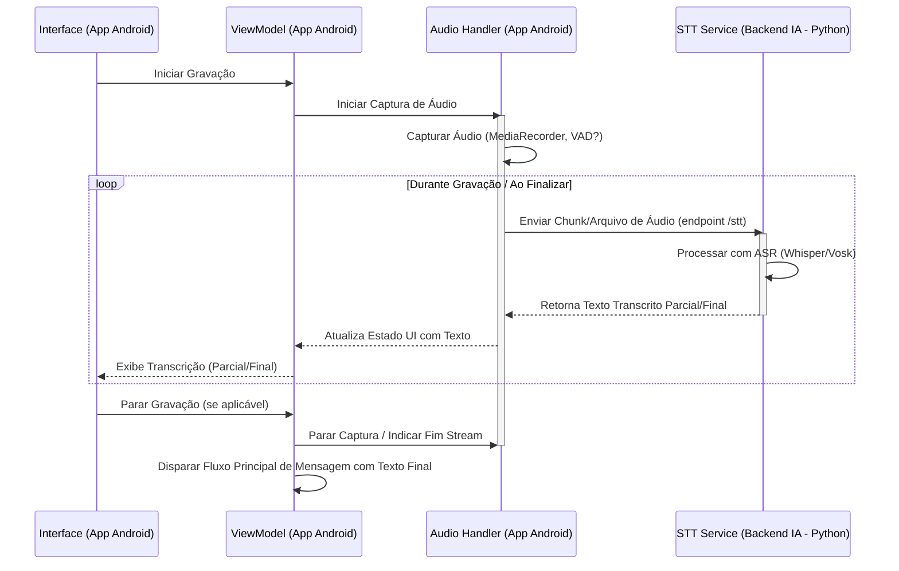
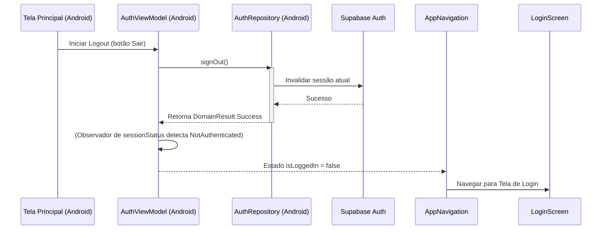

# Fluxo de Processamento Conceitual KITT

## 1. Visão Geral

O KITT implementa um fluxo de processamento para garantir interações inteligentes, éticas, contextuais e que respeitem o nível de acesso do usuário (monetização). Envolve **App Android**, **Backend de IA (Python)** e **Supabase**.

## 2. Fluxo Principal de Mensagens (Texto/Voz)

```mermaid
sequenceDiagram
    participant UI as Interface (App Android)
    participant VM as ViewModel (App Android)
    participant EM as EntitlementManager (App Android)
    participant Backend_IA as Backend IA (Python)
    participant DB as Supabase DB/Storage
    participant UsageTracker as UsageTracking (Backend IA)

    UI->>VM: Enviar Mensagem (Input Texto ou Trigger Pós-STT)
    VM->>VM: Validar Input Básico

    VM->>EM: Consultar Direitos Atuais
    EM-->>VM: Retorna Direitos (Tier, IAPs)

    VM->>Backend_IA: Verificar Ética Input (endpoint /verify-input-ethics)
    alt Violação Ética no Input
        Backend_IA-->>VM: Violação Detectada (com detalhes/sanção)
        VM-->>UI: Exibir Alerta/Bloqueio
    else Input Aprovado
        VM->>DB: Salvar Mensagem Usuário (via Backend ou Direto)
        
        opt Tier FREE
            VM->>Backend_IA: Verificar Limite Uso (endpoint /check-usage)
            alt Limite Atingido
                Backend_IA-->>VM: Limite Excedido
                VM-->>UI: Exibir Aviso de Limite
            else Limite OK
                 Backend_IA-->>VM: OK
                 VM->>Backend_IA: Gerar Resposta (endpoint /generate-response, envia Input, Direitos, Contexto)
            end
        else Tier PREMIUM
            VM->>Backend_IA: Gerar Resposta (endpoint /generate-response, envia Input, Direitos, Contexto)
        end

        activate Backend_IA
        Backend_IA->>Backend_IA: (AS) Selecionar Modelo AI (Baseado em Direitos)
        Backend_IA->>Backend_IA: (AS) Construir Contexto (RAG com consulta DB)
        Backend_IA->>Backend_IA: (AS) Chamar API LLM Externa
        Backend_IA->>Backend_IA: (AS) Recebe Resposta Bruta da IA
        
        Backend_IA->>Backend_IA: (EC) Verificar Ética (Resposta da IA)
        alt Violação na Resposta da IA
             Backend_IA-->>VM: Violação Detectada (Resposta Genérica Segura)
             VM-->>UI: Exibir Resposta Genérica Segura
        else Resposta da IA Aprovada
            Backend_IA->>Backend_IA: (PS) Aplicar Personalização (Voz/Estilo baseado em Direitos)
            Backend_IA->>Backend_IA: (PS) Gerar Áudio TTS (se aplicável)
            
            Backend_IA->>DB: Salvar Resposta Personalizada (Texto/Embedding)
            opt Tier FREE
                Backend_IA->>UsageTracker: Incrementar Uso API
            end
            Backend_IA-->>VM: Retorna Resposta Final (Texto e/ou URL/Stream Áudio TTS)
            deactivate Backend_IA

            VM-->>UI: Atualizar Interface (Exibir Texto / Iniciar Reprodução Áudio)
        end
    end
```

## 3. Componentes Chave do Fluxo (Conceitos)

*   **ViewModel (VM) (App Android):** Orquestra o fluxo no cliente, gerencia UI, chama Backend IA.
*   **EntitlementManager (EM) (App Android):** Consulta direitos localmente ou via Backend para informar chamadas.
*   **Backend IA (Python):** Contém a lógica principal e os seguintes serviços (conceituais):
    *   **EthicalControl (EC):** Analisa input/output quanto a conteúdo inadequado.
    *   **AIService (AS):** Abstrai RAG, seleção de modelo LLM, chamadas a APIs externas.
    *   **PersonalizationService (PS):** Aplica voz (TTS) e estilo com base nos direitos.
    *   **UsageTracking (UsageTracker):** Monitora e impõe limites para Free tier.
*   **Persistência (DB - Supabase):** Armazena perfis, histórico (com embeddings), entitlements, logs, etc. Acessado principalmente pelo Backend IA. App pode ter cache local (Room).

## 4. Fluxos Especializados (Conceitos)

### 4.1. Processamento de Voz (Entrada - STT)


*   O `AudioHandler` no App Android captura o áudio e o envia para o serviço `/stt` no **Backend de IA (Python)** para transcrição.

### 4.2. Análise de Contexto

*   Antes de chamar o endpoint `/generate-response` do Backend IA, o ViewModel (App Android) reúne informações relevantes:
    *   Histórico recente da conversa (do cache local/repositório).
    *   Outros dados do cliente (se houver).
*   Esse contexto é enviado ao **Backend de IA** como parte da requisição, onde será combinado com a busca vetorial (RAG) para construir o prompt final.

### 4.3. Fluxo de Autenticação (Email/Senha)

```mermaid
sequenceDiagram
    participant SignUpScreen as Tela Cadastro (Android)
    participant LoginScreen as Tela Login (Android)
    participant AuthVM as AuthViewModel (Android)
    participant AuthRepo as AuthRepository (Android)
    participant SupabaseAuth as Supabase Auth
    participant UserEmail as Caixa de Email do Usuário

    alt Cadastro
        SignUpScreen->>AuthVM: Iniciar Cadastro (email, senha)
        AuthVM->>AuthVM: Validar Inputs (formato email, força senha, etc.)
        opt Válido
            AuthVM->>AuthRepo: signUpWithEmail(email, senha)
            activate AuthRepo
            AuthRepo->>SupabaseAuth: Tentar criar usuário
            SupabaseAuth-->>AuthRepo: Sucesso (envio de confirmação iniciado)
            AuthRepo-->>AuthVM: Retorna DomainResult.Success
            deactivate AuthRepo
            AuthVM-->>SignUpScreen: Atualiza UI (isSignUpSuccess = true)
            SignUpScreen->>SignUpScreen: Exibe Dialog "Verifique seu email"
            SignUpScreen->>AuthVM: resetSignUpStatus()
            SignUpScreen->>LoginScreen: Navegar para Login
        else Inválido
            AuthVM-->>SignUpScreen: Exibe Erro de Validação
        end
        SupabaseAuth-xUserEmail: Envia Email de Confirmação
    end

    UserEmail->>SupabaseAuth: Usuário clica no Link de Confirmação
    SupabaseAuth->>SupabaseAuth: Marca usuário como confirmado
    SupabaseAuth-->>UserEmail: Redireciona para Site URL/Redirect URL (Navegador)

    alt Login
        LoginScreen->>AuthVM: Iniciar Login (email, senha)
        AuthVM->>AuthRepo: signInWithEmail(email, senha)
        activate AuthRepo
        AuthRepo->>SupabaseAuth: Tentar autenticar
        alt Credenciais Válidas e Confirmadas
            SupabaseAuth-->>AuthRepo: Sucesso (Sessão criada/retornada)
            AuthRepo-->>AuthVM: Retorna DomainResult.Success
            deactivate AuthRepo
            AuthVM->>AuthVM: (Observador de sessionStatus detecta Authenticated)
            AuthVM-->>AppNavigation: Estado isLoggedIn = true
            AppNavigation->>ChatScreen: Navegar para Tela Principal
        else Credenciais Inválidas / Não Confirmado
            SupabaseAuth-->>AuthRepo: Falha (Erro específico)
            AuthRepo->>AuthRepo: Mapeia Erro para mensagem amigável
            AuthRepo-->>AuthVM: Retorna DomainResult.Error(mensagem)
            deactivate AuthRepo
            AuthVM-->>LoginScreen: Exibe Mensagem de Erro
        end
    end
```
*   **Cadastro:** Requer confirmação por email. O app orienta o usuário e navega para a tela de login após o início do processo.
*   **Login:** Só funciona após o usuário clicar no link de confirmação recebido por email. O tratamento de erro diferencia credenciais inválidas de outros problemas.

### 4.4. Fluxo de Autenticação (Google Sign-In)

```mermaid
sequenceDiagram
    participant LoginScreen as Tela Login (Android)
    participant AuthVM as AuthViewModel (Android)
    participant AuthRepo as AuthRepository (Android)
    participant SupabaseComposeAuth as Supabase Compose Auth Lib
    participant GoogleSignIn as Google Sign-In SDK (Android)
    participant GoogleAuthServer as Servidor de Autenticação Google
    participant SupabaseAuth as Supabase Auth

    LoginScreen->>AuthVM: Iniciar Login com Google
    AuthVM->>AuthRepo: signInWithGoogle()
    activate AuthRepo
    AuthRepo->>SupabaseComposeAuth: signInWith(Google)
    deactivate AuthRepo
    activate SupabaseComposeAuth
    SupabaseComposeAuth->>GoogleSignIn: Inicia fluxo nativo do Google Sign-In
    activate GoogleSignIn
    GoogleSignIn->>GoogleAuthServer: Solicita autenticação do usuário
    GoogleAuthServer-->>GoogleSignIn: Retorna ID Token do Google
    deactivate GoogleSignIn
    SupabaseComposeAuth<--GoogleSignIn: Recebe ID Token
    SupabaseComposeAuth->>SupabaseAuth: Troca ID Token por Sessão Supabase
    activate SupabaseAuth
    SupabaseAuth-->>SupabaseComposeAuth: Retorna Sessão Supabase (ou erro)
    deactivate SupabaseAuth
    deactivate SupabaseComposeAuth
    
    AuthVM->>AuthVM: (Observador de sessionStatus detecta Authenticated)
    AuthVM-->>AppNavigation: Estado isLoggedIn = true
    AppNavigation->>ChatScreen: Navegar para Tela Principal

    Note right of GoogleAuthServer: Requer URI de Redirecionamento <br> `https://<id_projeto>.supabase.co/auth/v1/callback` <br> cadastrado no Google Cloud Console.
```
*   Usa o fluxo nativo do Google Sign-In no Android via `supabase-kt`/`ComposeAuth`.
*   Requer configuração correta do **URI de redirecionamento** no Google Cloud Console para evitar erros `redirect_uri_mismatch`.

### 4.5. Fluxo de Logout


*   Invalida a sessão no Supabase.
*   A mudança no `sessionStatus` (observado pelo `AuthViewModel.isLoggedIn`) dispara a navegação de volta para a tela de Login. 

## 5. Tratamento de Erros

*   **Retry:** Lógica de retry para chamadas de rede deve existir no App Android (para chamadas ao Backend IA) e no **Backend IA** (para chamadas a APIs externas como LLMs). Usar backoff exponencial.
*   **Hierarquia de Erros:** Definir erros específicos (App/Backend). Backend deve retornar códigos/mensagens de erro claros para o App.
*   **Tratamento no ViewModel:** Capturar exceções, atualizar UI, logar.

## 6. Otimizações

*   **Cache:** Cache local no App (Room) para histórico/perfis. Cache no **Backend IA** para respostas LLM (se aplicável), dados externos.
*   **Streaming:** Usar `Flow` no Android para receber texto/áudio do **Backend IA**. Backend IA deve suportar streaming de resposta LLM e áudio TTS.

## 7. Monitoramento

*   **Métricas/Logs:** Coletar em ambos, App Android e **Backend IA**. Usar IDs de correlação.

## 8. Considerações de Segurança

*   **Validação de Input:** No App e **principalmente no Backend IA**.
*   **Proteção de Dados:** HTTPS entre App e Backend. Backend lida com chaves de API externas e criptografia de dados sensíveis (BYOK).

## 9. Performance

*   Processamento assíncrono (Coroutines no App, async/await no Python).
*   Otimizações de UI (Compose).
*   Otimizações de rede/API.
*   Limites/Timeouts no App e **Backend IA**. 