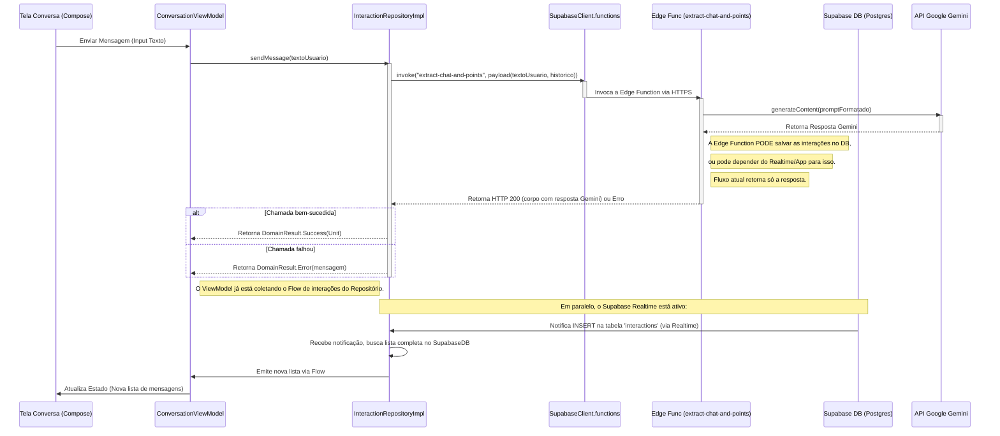

# Fluxo de Processamento - Jotape App

## 1. Visão Geral

O Jotape implementa um fluxo para interações de chat usando o App Android Nativo (Kotlin/Compose), uma **Edge Function no Supabase (`extract-chat-and-points`)** que orquestra a interação com a API Google Gemini, e o **banco de dados Supabase (Postgres)** para autenticação e persistência do histórico. A comunicação com o histórico utiliza **Supabase Realtime** para atualizações em tempo real, e o **`WorkManager`** para sincronização robusta em background.

## 2. Fluxo de Envio de Mensagem de Chat (Via Edge Function)

**Explicação Detalhada do Fluxo:**

1.  **Entrada do Usuário:** O usuário digita na `ConversationScreen` e clica em enviar.
2.  **ViewModel:** A `ConversationViewModel` recebe o texto, limpa o campo de input, marca `isSending = true` (ou estado de loading) e chama `interactionRepository.sendMessage(textoUsuario)`.
3.  **Repositório (`InteractionRepositoryImpl`):**
    *   Obtém o `userId` atual.
    *   Busca o histórico recente de interações no Supabase (via Postgrest).
    *   Prepara o payload (`ExtractChatPayload`) contendo a mensagem do usuário e o histórico formatado.
    *   Chama `supabaseClient.functions.invoke("extract-chat-and-points", body = payload)`. A biblioteca cliente lida com a adição de headers de autenticação necessários.
    *   **A Edge Function (`extract-chat-and-points`) executa a seguinte lógica:**
        *   Valida a requisição (e opcionalmente o JWT).
        *   Recebe o payload (mensagem atual, histórico).
        *   Chama a API do Google Gemini com o prompt formatado (incluindo histórico).
        *   Trata a resposta do Gemini.
        *   **Não salva no banco de dados neste fluxo.** A persistência é agora delegada ao cliente via Realtime ou Worker.
        *   Retorna uma resposta HTTP (200 OK com a resposta do Gemini no corpo, ou um erro apropriado).
    *   O Repositório recebe a resposta da função. Se a chamada foi bem-sucedida (HTTP 2xx), retorna `DomainResult.Success(Unit)` (indicando que a mensagem foi processada, mas a UI será atualizada via Realtime).
    *   Se a chamada falhou (erro de rede, erro 4xx/5xx da Edge Function), retorna `DomainResult.Error` com uma mensagem apropriada.
    *   O estado de loading no ViewModel é desativado.
4.  **Atualização da UI (Via Realtime):**
    *   **Importante:** Como a Edge Function *não* salva mais diretamente (neste fluxo), o Realtime será ativado quando *outro* mecanismo (como o `SyncInteractionWorker` ou uma escrita direta pelo app após receber a resposta) salvar as interações no banco de dados.
    *   O `InteractionRepositoryImpl` mantém um `Flow` aberto (usando `supabaseClient.realtime.postgresChangeFlow`) que escuta por inserções (`INSERT`) na tabela `interactions` para o usuário atual.
    *   Quando uma interação (seja do usuário ou do assistente) é salva no banco de dados por *qualquer* meio, o Supabase Realtime notifica o cliente (App Android).
    *   Ao receber a notificação, o `Flow` no repositório dispara uma nova busca completa da lista de interações no Supabase Postgrest, ordenada por timestamp.
    *   A nova lista de interações é emitida pelo `Flow`.
    *   O `ConversationViewModel`, que está coletando este `Flow`, recebe a lista atualizada.
    *   O ViewModel atualiza o `StateFlow` da UI.
    *   A `ConversationScreen` (Compose) reage a essa mudança no estado e re-renderiza a lista de mensagens.
5.  **Sincronização em Background (`SyncInteractionWorker`):**
    *   Este worker é enfileirado pelo `InteractionRepository` (ou `ViewModel`) quando novas interações são geradas localmente (antes mesmo de serem confirmadas pelo Realtime) ou como um mecanismo de fallback periódico.
    *   O `SyncInteractionWorker` busca interações locais que ainda não foram sincronizadas com o Supabase.
    *   Tenta salvar essas interações no Supabase Postgrest.
    *   Marca as interações como sincronizadas localmente em caso de sucesso.
    *   Retenta a sincronização em caso de falha (respeitando as políticas do `WorkManager`).
    *   **Nota:** A existência deste worker garante que, mesmo que a escrita via Edge Function ou Realtime falhe temporariamente, as mensagens eventualmente chegarão ao backend.

## 3. Componentes Chave do Fluxo (Implementação)

*   **ViewModel (`ConversationViewModel`):** Orquestra fluxo no cliente, observa estado do repositório via `Flow`.
*   **Repositório (`InteractionRepositoryImpl`):** Orquestra acesso a dados (Supabase Functions, Realtime, Postgrest), enfileira `WorkManager`.
*   **Edge Function (`extract-chat-and-points`):** Lógica server-side no Supabase (Deno/TypeScript) que interage com Gemini.
*   **Supabase Client (`SupabaseClient`, `Postgrest`, `Auth`, `Realtime`, `Functions`):** Biblioteca Kotlin para interagir com Supabase.
*   **Gemini SDK (`google-ai-generativelanguage` via `fetch` na Edge Function):** Biblioteca/API para interagir com a API Gemini do lado do servidor.
*   **WorkManager (`SyncInteractionWorker`, `HiltWorkerFactory`):** Para sincronização em background.
*   **Hilt Modules (`SupabaseModule`, `RepositoryModule`, `WorkerModule`):** Para injeção de dependência no Android.

## 4. Fluxos de Autenticação e Logout

*   **Email/Senha e Google Sign-In:** **Inalterado.** Usando `AuthViewModel`, `AuthRepositoryImpl` e `Supabase Auth` / `ComposeAuth`.
*   **Logout:** **Inalterado.** Invalida a sessão no Supabase, atualiza o estado `isLoggedIn` no `AuthViewModel` e causa a navegação para a tela de login.

## 5. Tratamento de Erros

*   **Repositório:** Captura exceções de rede (Retrofit/OkHttp), erros HTTP da Edge Function. Retorna `DomainResult.Error`.
*   **Edge Function:** Trata erros ao salvar no DB, buscar histórico, chamar Gemini (chave inválida, prompt bloqueado, quota excedida, etc.), erros de formatação de resposta. Retorna códigos de status HTTP e mensagens de erro apropriadas.
*   **ViewModel:** Observa o `DomainResult.Error` (tanto do `sendMessage` quanto do `Flow` de `getAllInteractions`) e atualiza o estado da UI para exibir mensagens de erro.

## 6. Otimizações

*   **~~Cache:~~** **Removido/Simplificado.** O estado principal vem do Supabase via Realtime/Postgrest. Pode haver um estado temporário no ViewModel.
*   **Realtime:** A UI é atualizada *eventualmente* quando novas mensagens são salvas no banco de dados (seja pelo Worker ou outro mecanismo) e a notificação chega.
*   **Edge Function:** Centraliza a lógica de interação com o Gemini e o banco de dados, simplificando o cliente.

## 7. Monitoramento

*   **Métricas/Logs:** Coletar em ambos, App Android e **Edge Function**. Usar IDs de correlação.

## 8. Considerações de Segurança

*   **Validação de Input:** No App e **principalmente na Edge Function**.
*   **Proteção de Dados:** HTTPS entre App e Supabase (Functions, Realtime, Postgrest). Edge Function lida com chaves de API externas (Gemini). App lida com chaves Supabase (anon key).

## 9. Performance

*   Processamento assíncrono (Coroutines no App, async/await na Edge Function).
*   Otimizações de UI (Compose).
*   Otimizações de rede/API.
*   Limites/Timeouts no App e **Edge Function**. 