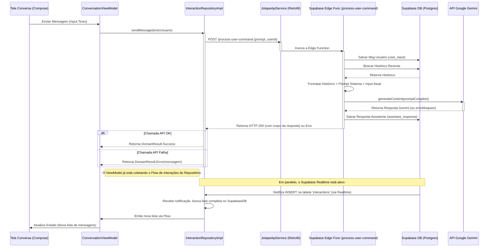

# Fluxo de Processamento - Jotape App

## 1. Visão Geral

O Jotape implementa um fluxo para interações de chat usando o App Android Nativo (Kotlin/Compose), uma **Edge Function no Supabase (`process-user-command`)** que orquestra a interação com a API Google Gemini e o **banco de dados Supabase (Postgres)** para autenticação e persistência do histórico. A comunicação com o histórico agora utiliza **Supabase Realtime** para atualizações em tempo real. **A funcionalidade offline foi removida.**

## 2. Fluxo de Envio de Mensagem de Chat

**Explicação Detalhada do Fluxo:**

1.  **Entrada do Usuário:** O usuário digita na `ConversationScreen` e clica em enviar.
2.  **ViewModel:** A `ConversationViewModel` recebe o texto, limpa o campo de input, marca `isSending = true` e chama `interactionRepository.sendMessage(textoUsuario)`.
3.  **Repositório (`InteractionRepositoryImpl`):**
    *   Obtém o `userId` atual.
    *   Chama a `JotapeApiService` (Retrofit) para invocar a Edge Function `process-user-command` no Supabase, passando o `prompt` (texto do usuário) e o `userId`. O `AuthInterceptor` adiciona os headers `apikey` e `Authorization` (JWT).
    *   **A Edge Function (`process-user-command`) executa a seguinte lógica:**
        *   Valida a requisição e o JWT.
        *   Salva a mensagem do usuário (`user_input`) na tabela `interactions` do Supabase Postgres, associada ao `user_id`.
        *   Busca as interações recentes (últimas N) para o `user_id` no Supabase Postgres.
        *   Formata o histórico recuperado e o prompt atual para enviar ao Gemini.
        *   Chama a API do Google Gemini (`gemini-2.0-flash`) com o prompt formatado.
        *   Trata a resposta do Gemini (incluindo possíveis erros ou bloqueios de segurança).
        *   Salva a resposta do assistente (`assistant_response`) na tabela `interactions` do Supabase Postgres.
        *   Retorna uma resposta HTTP (200 OK com a resposta do bot em caso de sucesso, ou um erro apropriado).
    *   O Repositório recebe a resposta da API. Se a chamada foi bem-sucedida, retorna `DomainResult.Success` para o ViewModel. Se falhou (erro de rede, erro 4xx/5xx da Edge Function), retorna `DomainResult.Error` com uma mensagem apropriada.
    *   O estado `isSending` no ViewModel é marcado como `false`.
4.  **Atualização da UI (Via Realtime):**
    *   Independentemente da chamada `sendMessage`, o `InteractionRepositoryImpl` mantém um `Flow` aberto (usando `supabaseClient.realtime.postgresChangeFlow`) que escuta por inserções (`INSERT`) na tabela `interactions` para o usuário atual.
    *   Quando a Edge Function salva a mensagem do usuário e depois a resposta do assistente no banco de dados, o Supabase Realtime notifica o cliente (App Android).
    *   Ao receber a notificação, o `Flow` no repositório dispara uma nova busca completa da lista de interações no Supabase Postgrest, ordenada por timestamp.
    *   A nova lista de interações é emitida pelo `Flow`.
    *   O `ConversationViewModel`, que está coletando este `Flow`, recebe a lista atualizada.
    *   O ViewModel atualiza o `StateFlow` da UI.
    *   A `ConversationScreen` (Compose) reage a essa mudança no estado e re-renderiza a lista de mensagens, exibindo as novas interações na ordem correta.
5.  **~~Worker em Background (`SyncInteractionWorker`):~~** **Removido.** A persistência agora é feita diretamente pela Edge Function, e a atualização da UI é via Realtime. Não há mais cache local ou sincronização em background.

## 3. Componentes Chave do Fluxo (Implementação)

*   **ViewModel (`ConversationViewModel`):** Orquestra fluxo no cliente, observa estado do repositório via `Flow`.
*   **Repositório (`InteractionRepositoryImpl`):** Orquestra acesso a dados (API via Retrofit, Supabase Realtime/Postgrest).
*   **API Service (`JotapeApiService`):** Interface Retrofit para chamar a Edge Function.
*   **Edge Function (`process-user-command`):** Lógica server-side no Supabase (Deno/TypeScript) que interage com DB e Gemini.
*   **Supabase Client (`SupabaseClient`, `Postgrest`, `Auth`, `Realtime`):** Biblioteca Kotlin para interagir com Supabase (Auth, DB, Realtime).
*   **Gemini SDK (`google-ai-generativelanguage` via `fetch` na Edge Function):** Biblioteca/API para interagir com a API Gemini do lado do servidor.
*   **Hilt (`PromptManager`, Modules):** Para injeção de dependência no Android.

## 4. Fluxos de Autenticação e Logout

*   **Email/Senha e Google Sign-In:** **Inalterado.** Usando `AuthViewModel`, `AuthRepositoryImpl` e `Supabase Auth` / `ComposeAuth`.
*   **Logout:** **Inalterado.** Invalida a sessão no Supabase, atualiza o estado `isLoggedIn` no `AuthViewModel` e causa a navegação para a tela de login.

## 5. Tratamento de Erros

*   **Repositório:** Captura exceções de rede (Retrofit/OkHttp), erros HTTP da Edge Function. Retorna `DomainResult.Error`.
*   **Edge Function:** Trata erros ao salvar no DB, buscar histórico, chamar Gemini (chave inválida, prompt bloqueado, quota excedida, etc.), erros de formatação de resposta. Retorna códigos de status HTTP e mensagens de erro apropriadas.
*   **ViewModel:** Observa o `DomainResult.Error` (tanto do `sendMessage` quanto do `Flow` de `getAllInteractions`) e atualiza o estado da UI para exibir mensagens de erro.

## 6. Otimizações

*   **~~Cache:~~** **Removido.** Não há mais cache local com Room.
*   **Realtime:** A UI é atualizada em tempo real assim que novas mensagens são salvas no banco de dados, proporcionando feedback rápido.
*   **Edge Function:** Centraliza a lógica de interação com o Gemini e o banco de dados, simplificando o cliente.

## 7. Monitoramento

*   **Métricas/Logs:** Coletar em ambos, App Android e **Edge Function**. Usar IDs de correlação.

## 8. Considerações de Segurança

*   **Validação de Input:** No App e **principalmente na Edge Function**.
*   **Proteção de Dados:** HTTPS entre App e Edge Function. Edge Function lida com chaves de API externas (Gemini, Supabase Service Key se necessário).

## 9. Performance

*   Processamento assíncrono (Coroutines no App, async/await na Edge Function).
*   Otimizações de UI (Compose).
*   Otimizações de rede/API.
*   Limites/Timeouts no App e **Edge Function**. 